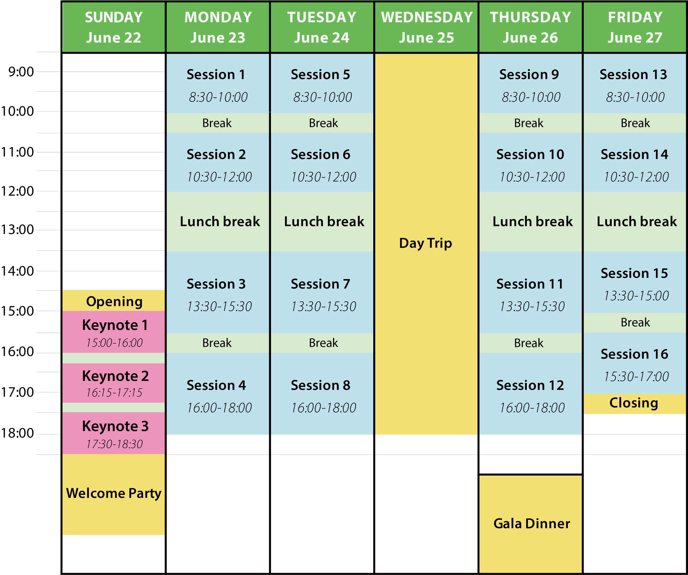

To accommodate the overwhelming number of submissions we received (thank you so much!), we have adjusted the schedule to **start sessions on Sunday**. 
This change allows us to maximize the number of presentation slots and include as many valuable contributions as possible.

### Special Program on Sunday Afternoon
   On Sunday afternoon, we will host three **Plenary sessions** in succession, followed by a **Welcome Party**. 
   We hope you can join us for an engaging start to the conference and meaningful networking opportunities.

### Weekday Sessions
   From Monday to Friday, there will be **three or four parallel sessions running from morning to evening**, featuring a wide variety of engaging presentations.
   We are also planning some social activities!

### Arrive Early Recommendation
   Given the updated start on Sunday, we highly recommend **booking your travel to arrive in Okinawa by Saturday**. 
   We encourage you to adjust your plans to fully participate in all Sunday activities.

Thank you for your understanding and cooperation! The detailed program will be announced soon—stay tuned!

For the details, please visit our [Program page](/program).

