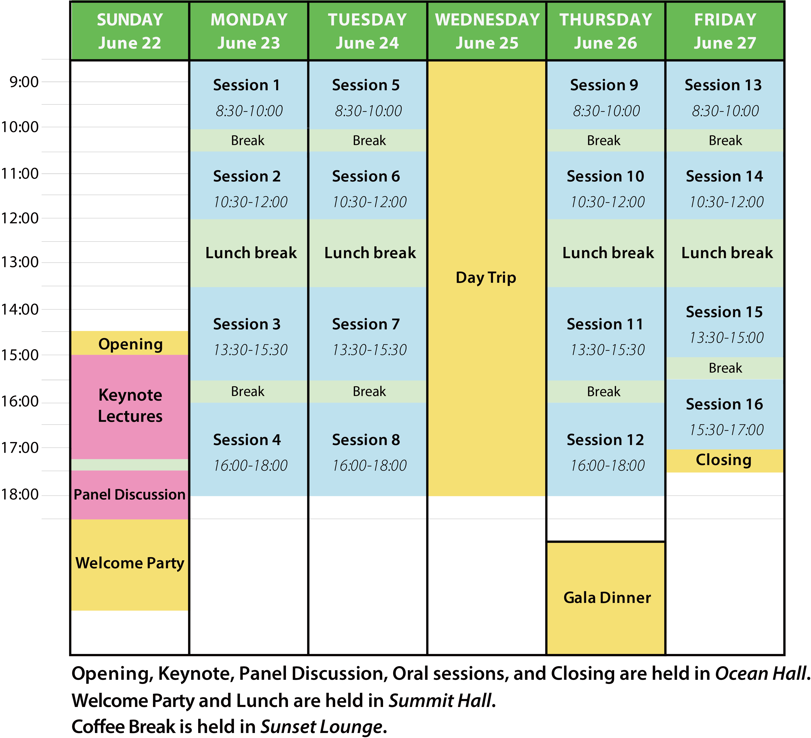

<!-- Please see below for a list of topics. -->

- [Final Program](#final-program)
- [Keynote Speakers](#keynote-speakers)

# <a name="final-program">Final Program</a>
---

The TRISTAN XII program is available here:
 
[TRISTAN2025_final_program.pdf](TRISTAN2025_final_program.pdf) (0.2MB)

### Special Program on Sunday Afternoon
   We will host **three Keynote sessions on Sunday afternoon** in succession, followed by a **Welcome Party**. 
   We hope you can join us for an engaging start to the conference and meaningful networking opportunities.

### Weekday Sessions
   From Monday to Friday, there will be **three parallel sessions running from morning to evening**, featuring a wide variety of presentations.
   We are also planning some social activities!
<!---
### Arrive Early Recommendation
   Given the updated start on Sunday, we highly recommend **booking your travel to arrive in Okinawa by Saturday**. 
   We encourage you to adjust your plans to fully participate in all Sunday activities.
--->

  
# <a name="keynote-speakers">Keynote Speakers</a>
---

## "Transportation Research for Social Impact in a Changing World: advances in humanitarian logistics and disaster response" by Dr. Karen Smilowitz
**Professor at Northwestern University, USA**

This talk includes a discussion of recent trends we have seen at Transportation Science and the changes we have made at the journal to broaden its scope, which is particularly relevant to the theme of transportation research for social impact in a changing world.

<!--
Dr. Karen Smilowitz is the James N. and Margie M. Krebs Professor in Industrial Engineering and Management Science at Northwestern University, with a joint appointment in the Operations group at the Kellogg School of Management. 
Dr. Smilowitz is an expert in modeling and solution approaches for logistics and transportation systems in both commercial and nonprofit applications. 
She has been instrumental in promoting the use of operations research within the humanitarian and nonprofit sectors through the Woodrow Wilson International Center for Scholars, the American Association for the Advancement of Science, and the National Academy of Engineering, as well as various media outlets. 
Dr. Smilowitz is the Editor-in-Chief of Transportation Science and a Fellow of the INFORMS society.

Dr. Smilowitz has worked on several projects in the area of operational improvement in community-based health care. 
Community-based operations research is the application of decision models to social issues of a local nature. 
The goal of this field is to design policies and tactics that have the potential to improve individual life outcomes and neighborhood-level outcomes by addressing welfare, equity and administrative efficiency simultaneously.
--->

 

## "Combinatorial choices" by Dr. Michel Bierlaire
**Professor at École Polytechnique Fédérale de Lausanne, Switzerland**  
*Joint work with Frédéric Meunier, Léa Ricard and Prunelle Vogler*

Traditional discrete choice models are grounded in the assumption that decision-makers solve a continuous optimization problem, with econometric formulations derived from its first-order optimality conditions. 
However, many real-world decisions involve selecting combinations of alternatives—such as planning a sequence of activities—rendering the choice inherently combinatorial. 
In such settings, the underlying decision problem becomes a combinatorial optimization task, for which standard optimality conditions do not apply. 
This lecture introduces the framework of combinatorial choice, with a focus on its relevance for modeling the activity schedules of travelers in the context of travel demand forecasting.

<!--
Michel Bierlaire holds a PhD in Mathematical Sciences from the University of Namur, Belgium. 
From 1995 to 1998, he served as a research associate and project manager at the Intelligent Transportation Systems Program at the Massachusetts Institute of Technology (MIT, Cambridge, Ma). 
Following this, he joined the Operations Research group ROSO within the Institute of Mathematics at EPFL as junior faculty, a position he held from 1998 to 2006. 
In 2006, he was appointed Associate Professor in the School of Architecture, Civil and Environmental Engineering at EPFL, where he now directs the Transport and Mobility Laboratory. 
In 2012, he was appointed full professor in the same school.

Dr. Bierlaire’s expertise lies in the design, development, and application of models and algorithms for transportation system analysis, design, and management. 
His work includes significant contributions to demand modeling, such as discrete choice models and the estimation of origin-destination matrices, as well as operations research topics like scheduling and assignment, and dynamic traffic management systems.

He is the founder of hEART, the European Association for Research in Transportation. Additionally, he served as the founding Editor-in-Chief of the EURO Journal on Transportation and Logistics from 2011 to 2019 and has been an Associate Editor of Operations Research since 2012.
--->

 

## "Participatory Traffic Control: Leveraging Connected and Automated Vehicles for Enhanced Network Efficiency" by Dr. Yafeng Yin
**Professor at University of Michigan, USA**

Participatory traffic control is an emerging paradigm that envisions vehicles within the traffic stream serving as active control actuators to enhance the performance of traffic networks. 
With rapid advances in vehicle connectivity and automation, travelers are increasingly likely to relinquish personal control over certain travel decisions. 
This shift enables the development of a participatory traffic control framework, where a subset of connected and automated vehicles (CAVs) function as “traffic demand distributors.” 
By coordinating their departure times and route choices, these CAVs can influence the travel behavior of others, thereby improving overall system efficiency. 
This talk presents methods for enabling CAVs to stabilize day-to-day traffic dynamics and reduce congestion. 
It also explores the design of incentive mechanisms to encourage CAVs to participate as control agents within the broader traffic system.

<!--
Dr. Yafeng Yin is Donald Cleveland Collegiate Professor of Engineering, and Professor and Donald Malloure Department Chair of Civil and Environmental Engineering, and Professor of Industrial and Operations Engineering at University of Michigan, Ann Arbor. 
His research aims to analyze and enhance multimodal transportation systems towards efficiency, resilience and environmental sustainability. 
Currently he focuses on developing innovative mobility solutions and services by leveraging vehicle connectivity and automation. 
Dr. Yin has published over 150 refereed papers in leading academic journals. 
He also has extensive experience with editing academic journals. 
He was the Editor-in-Chief of Transportation Research Part C: Emerging Technologies between 2014 and 2020 and currently serves as Area Editor of Transportation Science and Associate Editor of Transportation Research Part B: Methodological, another two flagship journals in the transportation domain. 
He also serves on the International Advisory Committee of the International Symposium of Transportation and Traffic Theory (ISTTT) and the Steering Committee of the World Conference on Transport Research Society (WCTRS).
--->

