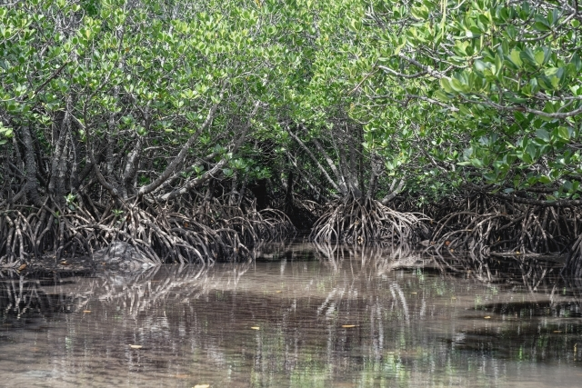

Okinawa island, located in the southernmost region of Japan, offers a captivating blend of natural beauty and rich cultural heritage influenced by its history of being an independent kingdom, then later becoming a part of Japan. We are delighted to host the TRISTAN symposium in Okinawa.

You can find official travel guide to Okinawa at [VISIT OKINAWA JAPAN](https://visitokinawajapan.com/).

## Venue
The symposium will be held at the [Bankoku Shinryokan](https://www.shinryokan.com/menuIndex.jsp?id=21545&menuid=6407&funcid=28). It is located in the centeral part of Okinawa island, standing on Busena Point, one of the most scenic spots in Okinawa, surrounded by the beautiful emerald ocean and blue sky. "Bankoku Shinryo" meaning "Bridge between Nations," is named after a phrase carved on the large bell at Shuri Castle. Since the 14th century, the Ryukyu Kingdom strived to promote cultural exchange through trade with China and Southeast Asia (from the official website). We believe this is a perfect venue for the fantastic TRISTAN symposium to foster international networking and collaborations!

<!--|||
|---|---|
|||-->

     

         
     

     

         
     

## Getting to the Venue
To get to the venue, all participants can arrive at **Naha Airport**, the main and largest airport in Okinawa. Naha Airport has direct connections from major cities around Asia. Domestic flights also frequently operate to Naha from the two **Tokyo Airports** (Haneda and Narita), and many other major airports around Japan. 

After arriving at Naha Airport, there are convenient, safe and on-time bus lines connecting to around the venue. You can also rent a car to get around the Okinawa Island.

More information on transportation, including the bus network, is available at the [official travel guide website](https://visitokinawajapan.com/plan-your-trip/getting-around-okinawa/).

<!--|||
|---|---|
|||

<ul>
<li></li>
<li></li>
</ul>-->

     

         
     

     

         
     

## Accommodation
We plan to prepare recommendations of various types of accommodation so that every participant, including professors, researchers, students and practitioners, can find a suitable place to stay.

If you need the information before the announcement, please send us e-mail from the [contact form](/contact). 
 
 

## Attractors in Okinawa (to name a few)

### Beaches around the venue
The conference venue is surrounded by a number of beautiful beaches. 
Busena Beach in Okinawa offers pristine white sands, clear turquoise waters, and vibrant coral reefs for travelers to relax and explore. 
Manzamo, Okinawa's iconic cape, captivates with dramatic cliffs and panoramic ocean views, showcasing nature's breathtaking beauty.

     

         
     

     

         
     

### History and tradition of the Ryukyu Islands
Shuri Castle (Shuri-jō), located in Naha, Okinawa, is a historical landmark that once served as the palace of the Ryukyu Kingdom. Dating back to the 14th century, this castle is a symbol of Okinawa's distinct cultural heritage, blending Japanese, Chinese, and Southeast Asian architectural influences. Known for its striking red tiles and the iconic Shureimon gate, the castle showcases the unique Ryukyuan style. It functioned as the political and administrative center of the Ryukyu Kingdom for centuries. Shuri Castle has undergone several reconstructions due to wars and fires, including significant damage during World War II and a recent fire in 2019. Despite these challenges, the castle remains a testament to the resilience of Okinawan culture. 
<!--Today, as a UNESCO World Heritage Site, it attracts visitors worldwide, offering insights into the rich history and traditions of the Ryukyu Islands.-->

     

         
     

     

         
     

### Isolated islands surrounding Okinawa Island
Okinawa Prefecture is renowned for its beautiful and diverse islands, beyond the main island of Okinawa. These islands, each with unique charms, offer a glimpse into the rich culture and stunning natural landscapes of the region. These islands, along with many others in Okinawa Prefecture, provide a tranquil escape and an opportunity to experience the serene beauty and rich cultural heritage distinct to this part of Japan.
<!--Kume Island stands out for its unique geographical features, such as the Tatami Ishi, a striking rock formation resembling tatami mats. The island also boasts a rich history, evident in historical sites like Uegusuku Castle, which offers panoramic views of the island.
The Kerama Islands, a short trip from the main island, are a group of smaller islands like Tokashiki and Zamami, celebrated for their pristine beaches and excellent diving spots.
Ishigaki Island, part of the Yaeyama Islands, is famous for its crystal-clear waters and vibrant coral reefs It's also the gateway to the surrounding islands, including the picturesque Taketomi Island, known for its traditional Ryukyuan houses and star-shaped sand beaches.-->

     

         
     

     

         
     

### Mangrove forests
<!--Mangroves are predominantly located in the estuaries and along the coastlines where freshwater meets seawater, creating a unique habitat. The mangroves are distinguished by their dense root systems, which not only protect shorelines from erosion but also provide a breeding ground and nursery for various marine species, including fish, crustaceans, and mollusks.-->
Mangrove forests in Okinawa are not just ecological treasures; they are also culturally significant. They have been traditionally used in local industries, such as fishing and salt production. Today, these mangroves are popular among tourists for activities like kayaking and guided nature walks, offering a chance to explore and learn about these vital ecosystems. Their importance in carbon sequestration, especially in the fight against climate change, further underscores the value of preserving Okinawa's mangroves.

     

         
     

     

         
     

