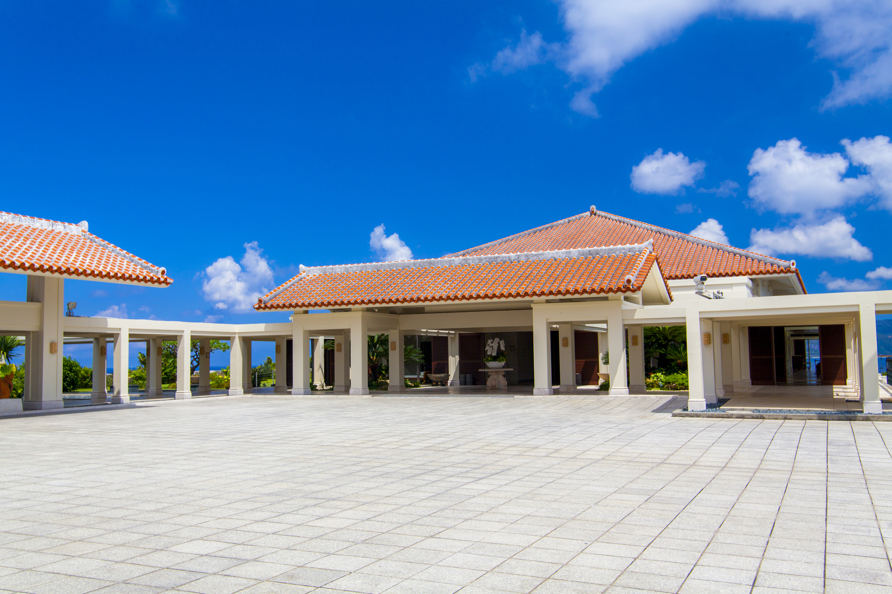
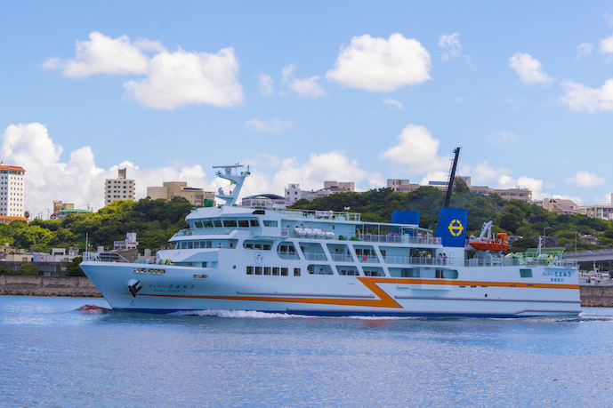
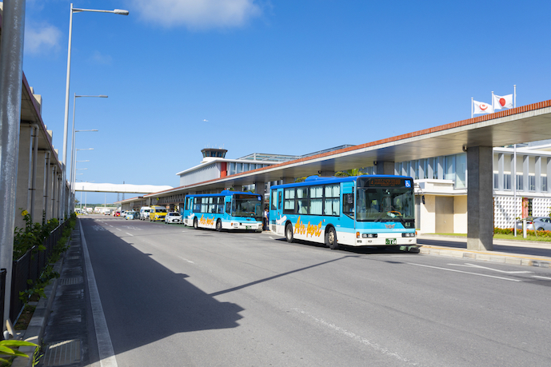

The symposium will be held at the [Bankoku Shinryokan](https://www.shinryokan.com/menuIndex.jsp?id=21545&menuid=6407&funcid=28), located in the central part of Okinawa island. It stands on Busena Point, one of the most scenic spots in Okinawa, surrounded by the beautiful emerald ocean and blue sky. "Bankoku Shinryo" meaning "Bridge between Nations," is named after a phrase carved on the large bell at Shuri Castle. Since the 14th century, the Ryukyu Kingdom strived to promote cultural exchange through trade with China and Southeast Asia (from the official website). We believe this is a perfect venue for the fantastic TRISTAN symposium to foster international networking and collaborations!

<!--|||
|---|---|
|||-->

     

         
     

     

         
     

　<iframe src="https://www.youtube.com/embed/TmkYzpFzFJ4?si=HWEVwH5LzWbRpqYn" frameboader="0"></iframe>

<!-- 
The introductory video is also available on [YouTube](https://youtu.be/TmkYzpFzFJ4?si=StM5SNE_MU0fTmVy).
 -->

## Getting to the Venue
To get to the venue, all participants can arrive at **Naha Airport**, the main and largest airport in Okinawa. Naha Airport has direct connections from major cities around Asia. Domestic flights also frequently operate to Naha from the **two Airports in Tokyo** (Haneda and Narita), and many other major airports around Japan. 

After arriving at Naha Airport, there are convenient, safe and on-time bus lines connecting to around the venue. You can also rent a car to get around the Okinawa Island.

More information on transportation, including the bus network, is available at the [official travel guide website](https://visitokinawajapan.com/plan-your-trip/getting-around-okinawa/).

<!--|||
|---|---|
|||

<ul>
<li></li>
<li></li>
</ul

     

         
     

     

         
     

>-->

## Accommodation
We have prepared prior reservation for two types of accommodation so that every participant, including professors, researchers, students, and practitioners, can find a suitable place to stay.
If you need the information more details, please e-mail us from the [contact page](/contact). 
 

### 1. [The Busena Terrace](https://www.terrace.co.jp/en/)
The hotel is adjacent to Bankoku Shinryokan,  our venue, and has eight different types of restaurants on the premises and a variety of facilities including a private beach, indoor and outdoor pools, gym, and sauna. Fine cuisine, round-the-clock butler service, sybaritic spa treatments, and an exciting range of marine and other outdoor activities are all part of an enjoyable your time. A dedicated reservation site is being prepared.

### 2. [Hotel Yugaf Inn Okinawa](https://www.yugaf.com/en/)
Hotel Yugaf Inn Okinawa is a city resort facing Nago Bay, where guests can experience the emerald green ocean and ubtropical climate. They provide a relaxing and peaceful stay in Yanbaru, where a day feels eternal. From the hotel you can reach Bankoku Shinryokan, our venue, in 15 minutes by car. We also provide a private bus every morning and night.  A dedicated reservation site is being prepared.

