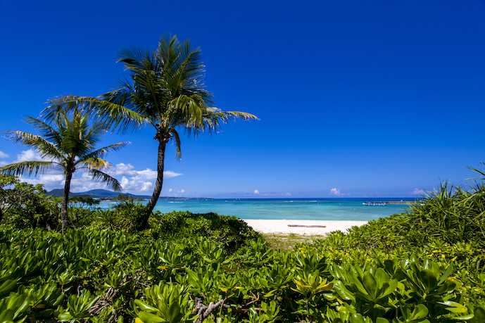
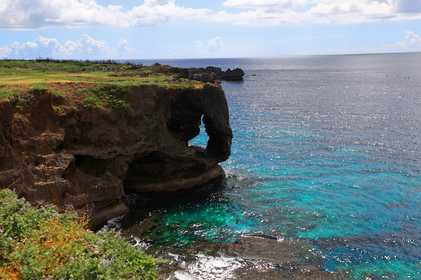

Okinawa island, located in the southernmost region of Japan, offers a captivating blend of natural beauty and rich cultural heritage influenced by its history of being an independent kingdom, then later becoming a part of Japan.

You can find official travel guide to Okinawa at [VISIT OKINAWA JAPAN](https://visitokinawajapan.com/).

## Venue
The symposium will be held at the [Bankoku Shinryokan](https://www.shinryokan.com/menuIndex.jsp?id=21545&menuid=6407&funcid=28). It is located in the centeral part of Okinawa island, standing on Busena Point, one of the most scenic spots in Okinawa, surrounded by the beautiful emerald ocean and blue sky. "Bankoku Shinryo" meaning "Bridge between Nations," is named after a phrase carved on the large bell at Shuri Castle. Since the 14th century, the Ryukyu Kingdom strived to promote cultural exchange through trade with China and Southeast Asia (from the official website). We believe this is a perfect venue for the fantastic TRISTAN symposium to foster international networking and collaborations!

<!--|||
|---|---|
|||-->

<ul>
<li></li>
<li></li>
</ul>

## Getting to the Venue
To get to the venue, all participants can arrive at **Naha Airport**, the main and largest airport in Okinawa. Naha Airport has direct connections from major cities around Asia. Domestic flights also frequently operate to Naha from the two **Tokyo Airports** (Haneda and Narita), and many other major airports around Japan. 

After arriving at Naha Airport, there are convenient, safe and on-time bus lines connecting to around the venue. You can also rent a car to get around the Okinawa Island.

More information on transportation, including the bus network, is available at the [official travel guide website](https://visitokinawajapan.com/plan-your-trip/getting-around-okinawa/).

<!--|||
|---|---|
|||-->

<ul>
<li></li>
<li></li>
</ul>

## Accommodation
We plan to prepare recommendations of various types of accommodation so that every participant, including professors, researchers, students and practitioners, can find a suitable place to stay.

<!--## Glance at Okinawa

### Beaches around the venue

|||
|---|---|
|||
-->

