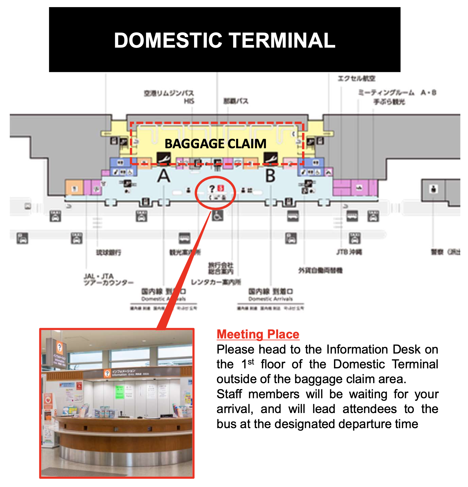
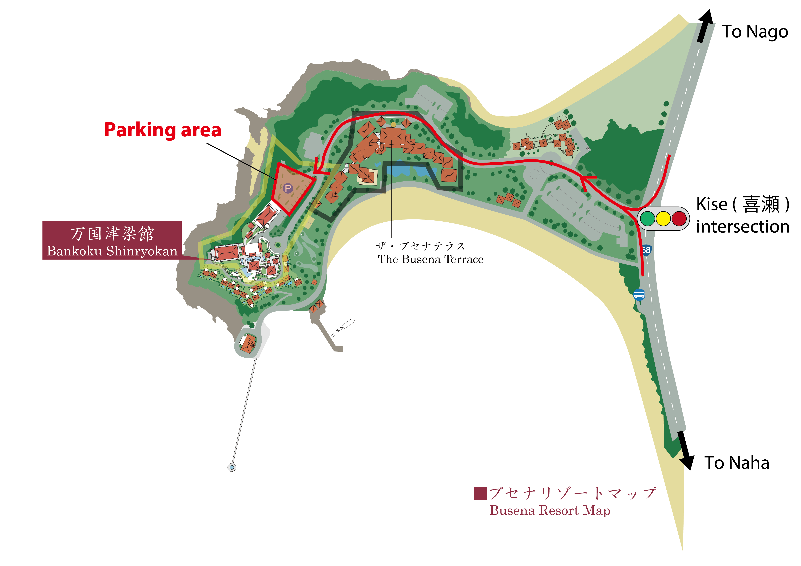

- [Access information](#access)
  - [From Naha Airport to the venue / Nago city center](#access-arrival)
  - [Sunday: from Nago to the venue (Before Keynote and Welcome party)](#access-sunday)
  - [Session days (Monday, Tuesday, Thursday, Friday)](#access-session-days)
  - [Wednesday: Social tour](#access-social-tour)
  - [Thursday evening: Gala dinner](#access-gala)
  - [Saturday, June 28: From Nago to Naha Airport](#access-departure)
- [Rental car information](#rental-car)
- [Venue - Bankoku Shinryokan](#venue)
- [Accommodation](#accommodation)

  

# <a name="access">Access information</a>
---
<!---
### Transportation Information, including parking area, private shuttle bus from Nago, and private airport shuttle bus is available [here](Transportation_info_TRISTAN.pdf).
--->

To get to the venue, all participants can arrive at **Naha Airport**, the main and largest airport in Okinawa. 
Naha Airport has direct connections from major cities in Asia. 
Domestic flights frequently operate to Naha from the **two Airports in Tokyo** (Haneda and Narita) and many other major airports in Japan. 

The following map summarizes the locations and expected travel times between Naha airport, the conference venue, and Nago city center (where affordable accommodations are available -- see [Accommodation](#accommodation)). 

<!------>

## <a name="access-arrival">From Naha Airport to the venue / Nago city center</a>
### Naha Airport &rarr; Venue
|Naha A.P. domestic terminal| Naha A.P. Int'l terminal|Arrival  | Notes                     |
|---------------------------|-------------------------|-------------------------|---------------------------|
| 9:00                      | 9:01                    | 11:06 (Kariyushi Beach Mae)  |OAS Resort liners (RSL #5) |
| 11:00                     | 11:01                   | 13:06 (Kariyushi Beach Mae)  |OAS Resort liners (RSL #9) |
| 11:30                     | 11:32                   | 13:08 (Busena Terrace)  |Airport Limousine Bus (DE) |
| 12:30                     | 12:31                   | 14:36 (Kariyushi Beach Mae)  |OAS Resort liners (RSL #13) |
| 12:45                     | -                       | 14:00 (Bankoku shinryokan, venue)  |Official TRISTAN shuttle (**only Sunday**)|
| 13:50                     | 13:52                   | 15:58 (Busena Terrace)  |Airport Limousine Bus (CD) |
| 14:40                     | 14:41                   | 16:48 (Kariyushi Beach Mae)  |OAS Resort liners (RSL #17) |
| 15:00                     | 15:02                   | 17:03 (Busena Terrace)  |Airport Limousine Bus (CD) |
| 15:30                     | 15:31                   | 17:38 (Kariyushi Beach Mae)  |OAS Resort liners (RSL #19) |
| 16:10                     | 16:12                   | 18:13 (Busena Terrace)  |Airport Limousine Bus (CD) |
| 17:00                     | 17:01                   | 19:07 (Kariyushi Beach Mae)  |OAS Resort liners (RSL #21) |
| 18:10                     | 18:12                   | 20:13 (Busena Terrace)  |Airport Limousine Bus (CD) |

- :bus: **Bus** (JPY 1,600 - 2,500)
  - :bus: [Airport Limousine Bus (Area CD, D, DE)](https://okinawabus.com/en/ls/)
    - Book/take a bus from Naha Airport Terminal to "Orion Hotel Motobu Resort & Spa" or "Kanehide Kise Beach Palace".
    - Alight the bus at the bus stop "The Busena Terrace" 
    - Book tickets [online](https://japanbusonline.com/en/Detail/14700010001/0/9472018001/9472018002/20250622) or at the [airport domestic terminal](https://okinawabus.com/en/ls/ls_carstop/) (open 11:00 - 18:00) - A reservation is required to board the bus.
    - The bus departs from the bus stop 12 at the domestic terminal ([map](https://www.naha-airport.co.jp/en/access/bus/)).
    - [How to ride on a limousine bus](https://okinawabus.com/en/ls/ls_ridemethod/)
  - :bus: [OAS Resort liners (RSL・RSL Rapid #5, 9, 13, 17, 19, 21)](https://www.okinawa-shuttle.co.jp/en/) 
    - Naha A.P. International/domestic Terminal - Kariyushi Beach Mae and 20 minutes walk to the venue ([timetable](https://www.okinawa-shuttle.co.jp/en/timetable/))
    - Book tickets [online](https://willer-travel.com/en/bus_search/okinawa/all/okinawa/churaumi/ym_202506/day_22/operation_791/?stockNumberMale=0&stockNumberFemale=0&kkf=1&simpleRouteCode=2488001&rid=3&lang=en) or at [Naha Airport International terminal Tourist Information Center](https://www.okinawa-shuttle.co.jp/en/howtobuy/) (open 9:00 - 18:00). You can also buy tickets at the bus stop.
    - Payment can be made by cash or credit card.
    - The bus departs from the bus stop 1 at the domestic terminal ([map](https://www.naha-airport.co.jp/en/access/bus/)).
- :taxi: **Taxi** (JPY 15,000 - 20,000)
  - To reserve taxis,  download the DiDi ([App Store](https://apps.apple.com/app/id1362398401); [Google Play](https://play.google.com/store/apps/details?id=com.didiglobal.passenger&hl=en)) or GO ([App Store](https://apps.apple.com/us/app/go-taxi-app-for-japan/id1254341709); [Google Play](https://play.google.com/store/apps/details?id=com.dena.automotive.taxibell&hl=en)) apps.
  - You can also call the [Daiichi Kotsu Multilingual Interpretation Center](https://daiichikoutsu.jp/taxi/interpreter/english/) at +81-92-687-8008 for reservations.
  - Taxi stand at Naha Airport ([map](https://www.naha-airport.co.jp/en/access/taxi/))
- :bus: **Private shuttle bus**
  - We will provide a private shuttle bus departing from Naha airport at 12:45 and arriving at the venue at 14:00 on June 22.
  - The shuttle is free of charge and accommodates up to 55 passengers. **Seats will be available on a first-come, first-served basis.**
  - If the number of passengers exceeds the seating capacity, you may not be able to board. In that case, please use the public transportation options.
  - Staff will be waiting at the domestic terminal arrival lobby from 12:15 — please speak to them upon arrival.
    

### Naha Airport &rarr; Nago City Center
<!---
|Naha A.P. domestic terminal| Naha A.P. Int'l terminal|Arrival  | Notes                     |
|---------------------------|-------------------------|-------------------------|---------------------------|
| 9:00                      | 9:01                    | 11:26 (Nago-shiyakusyo Mae)  |OAS Resort liners (RSL #5) |
| 10:20                     | 10:21                   | 11:44 (Nago-shiyakusyo Mae)  |OAS Resort liners (Rapid #7) |
| 11:00                     | 11:01                   | 13:26 (Nago-shiyakusyo Mae)  |OAS Resort liners (RSL #9) |
| 11:30                     | 11:31                   | 12:54 (Nago-shiyakusyo Mae)  |OAS Resort liners (Rapid #11) |
| 11:30                     | 11:32                   | 13:39 (Nago bus terminal)  |Airport Limousine Bus (DE) |
| 12:30                     | 12:31                   | 14:56 (Nago-shiyakusyo Mae)  |OAS Resort liners (RSL #13) |
| 13:45                     | 13:46                   | 15:09 (Nago-shiyakusyo Mae)  |OAS Resort liners (Rapid #15) |
| 14:40                     | 14:41                   | 17:05 (Nago-shiyakusyo Mae)  |OAS Resort liners (RSL #17) |
| 15:30                     | 15:31                   | 17:55 (Nago-shiyakusyo Mae)  |OAS Resort liners (RSL #19) |
| 17:00                     | 17:01                   | 19:27 (Nago-shiyakusyo Mae)  |OAS Resort liners (RSL #21) |
--->
- :bus: **Bus** (JPY 1,600 - 2,500)
  - :bus: [OAS Resort liners (RSL・RSL Rapid)](https://www.okinawa-shuttle.co.jp/en/) 
    - Naha A.P. International/domestic Terminal - Nago-shiyakusho mae (Nago City Office) ([timetable](https://www.okinawa-shuttle.co.jp/en/timetable/))
    - Book tickets [online](https://willer-travel.com/en/bus_search/okinawa/all/okinawa/churaumi/ym_202506/day_21/operation_791/?stockNumberMale=0&stockNumberFemale=0&kkf=1&simpleRouteCode=2488001&rid=3&lang=en) or at [Naha Airport International terminal Tourist Information Center](https://www.okinawa-shuttle.co.jp/en/howtobuy/) (open 9:00 - 18:00). You can also buy tickets at the bus stop.
    - Payment can be made by cash or credit card.
    - The bus departs from the bus stop 1 at the domestic terminal ([map](https://www.naha-airport.co.jp/en/access/bus/)).
  - :bus: [Bus Route 111, 117, 120](https://okinawabus.com/en/rb/rb_routelist/)
    - Naha Airport Domestic Terminal - Naha Airport International Terminal - Nago-shiyakusho mae (Nago City Office), Nago Bus Terminal
    - For payment by credit card, touch the card reader with your IC card or smartphone when getting on and off the bus.
    - For payment by cash, you can pay the fare after the ride. Take a boarding ticket when you get on the bus and make the payment before getting off the bus. Please check the [boarding guide](https://okinawabus.com/en/rb/rb_userguide/rb_ridemethod/) carefully.
    - The bus departs from the bus stop 2 at the domestic terminal and the bus stop 2 at the international terminal  ([map](https://www.naha-airport.co.jp/en/access/bus/)).
    
  - :bus: [Yanbaru Express Bus (YKB888)](https://yanbaru-expressbus.com/)
    - Naha Airport Int'l/domestic Terminal - Nago-shiyakusho mae (Nago City Office), Nago bus terminal mae, Hokubukaikan, Hotel Resonex Nago
    - You can pay the fare to the driver when getting on the bus.
    - Payment can be made by cash or credit card.
    - The bus departs from the bus stop 2 at the domestic terminal and the bus stop 2 at the international terminal  ([map](https://www.naha-airport.co.jp/en/access/bus/)).
  - :bus: [Airport Limousine Bus (Area DE)](https://okinawabus.com/en/ls/)
    - Book/take a bus from Naha Airport Terminal to "Orion Hotel Motobu Resort & Spa".
    - Alight the bus at the bus stop "Nago Bus Terminal" 
    - Book tickets [online](https://japanbusonline.com/en/Detail/14700010001/0/9472018001/9472018002/20250621) or at the [airport domestic terminal](https://okinawabus.com/en/ls/ls_carstop/) (open 11:00 - 18:00) - A reservation is required to board the bus.
    - The bus departs from stop 12 at the domestic terminal ([map](https://www.naha-airport.co.jp/en/access/bus/)).
    - [How to ride on a limousine bus](https://okinawabus.com/en/ls/ls_ridemethod/)
- :taxi: **Taxi** (JPY 15,000 - 20,000)
  - To reserve taxis,  download the DiDi ([App Store](https://apps.apple.com/app/id1362398401); [Google Play](https://play.google.com/store/apps/details?id=com.didiglobal.passenger&hl=en)) or GO ([App Store](https://apps.apple.com/us/app/go-taxi-app-for-japan/id1254341709); [Google Play](https://play.google.com/store/apps/details?id=com.dena.automotive.taxibell&hl=en)) apps.
  - You can also call the [Daiichi Kotsu Multilingual Interpretation Center](https://daiichikoutsu.jp/taxi/interpreter/english/) at +81-92-687-8008 for reservations.
  - Taxi stand at Naha Airport ([map](https://www.naha-airport.co.jp/en/access/taxi/))

---
## <a name="access-sunday">Sunday: from Nago to the venue (Before Keynote and Welcome party)</a>

- :bus: **Private shuttle bus**
  - We will provide a private shuttle from Nago city center to the conference venue.
  - Bus stops (see [the bus map](access/bus_map.pdf) for exact locations): 1. Hotel Yugaf Inn Okinawa, 2. Nago City Hall, 3. Nago Shokuan mae bus stop, 4. Hotel Route Inn Nago, 5. Best Western Okinawa Kouki Beach Hotel, 6. Bankoku Shinryokan
  - Schedule:
    - Hotel Yugaf Inn Okinawa (13:00) → Venue (14:00, before Keynote)
    - Hotel Yugaf Inn Okinawa (17:30) → Venue (18:30, before Welcome Party) [Mainly for accompanying guests]
    - Venue → Hotel Yugaf Inn Okinawa (after Welcome Party)
  - When staff are no longer present, the bus has already departed. Please also check the spreadsheet for real-time updates and a detailed timetable: 
    
    👉[Bus real-time location spreadsheet](https://docs.google.com/spreadsheets/d/1BQuWNfjrmYsDcWUNj8SbrtjtIQmE1mEpy19AWzXI-uc/preview)
- :bus: [Airport Limousine Bus (Area DE)](https://okinawabus.com/en/ls/)
  - Nago Bus Terminal &harr; The Busena Terrace Beach Resort and 10 minutes walk to the venue ([timetable](https://okinawabus.com/en/ls/ls_timetable_fares/))
  - Book tickets [online](https://okinawabus.com/en/ls/book-tickets/) or at the Nago Bus Terminal - You cannot get on the bus without a reservation.
  - [How to ride on a limousine bus](https://okinawabus.com/en/ls/ls_ridemethod/)
- :bus: [Bus Route 120](https://okinawabus.com/en/rb/rb_routelist/)
  - Nago Bus Terminal &harr; Nago-shiyakusho mae (Nago City Office) - Naha Airport
  - For payment by credit card, touch the card reader with your IC card or smartphone when getting on and off the bus.
  - For payment by cash, you can pay the fare after the ride. Take a boarding ticket when you get on the bus and make the payment before getting off the bus. Please check the [boarding guide](https://okinawabus.com/en/rb/rb_userguide/rb_ridemethod/) carefully.
  
- :taxi: **Taxi** (JPY 3,000 -)
  - To reserve taxis,  download the DiDi ([App Store](https://apps.apple.com/app/id1362398401); [Google Play](https://play.google.com/store/apps/details?id=com.didiglobal.passenger&hl=en)) or GO ([App Store](https://apps.apple.com/us/app/go-taxi-app-for-japan/id1254341709); [Google Play](https://play.google.com/store/apps/details?id=com.dena.automotive.taxibell&hl=en)) apps.
  - You can also call the [Daiichi Kotsu Multilingual Interpretation Center](https://daiichikoutsu.jp/taxi/interpreter/english/) at +81-92-687-8008 for reservations.

---
## <a name="access-session-days">Session days (Monday, Tuesday, Thursday, Friday)</a>
- :bus: **Private shuttle bus**
  - We will provide a private shuttle between Nago city center ande the venue on every morning and evening of the session days.
  - Bus stops (see [the bus map](access/bus_map.pdf) for exact locations): 1. Hotel Yugaf Inn Okinawa, 2. Nago City Hall, 3. Nago Shokuan mae bus stop, 4. Hotel Route Inn Nago, 5. Best Western Okinawa Kouki Beach Hotel, 6. Bankoku Shinryokan
  - Schedule:
    - Morning: Hotel Yugaf Inn Okinawa (7:15) → Venue (8:15)
    - Evening: Venue (18:15) → Hotel Yugaf Inn Okinawa (19:15) *except Thursday evening
  - When staff are no longer present, the bus has already departed. Please also check the spreadsheet for real-time updates and a detailed timetable: 
    
    👉[Bus real-time location spreadsheet](https://docs.google.com/spreadsheets/d/1BQuWNfjrmYsDcWUNj8SbrtjtIQmE1mEpy19AWzXI-uc/preview)
- :bus: [Airport Limousine Bus (Area DE)](https://okinawabus.com/en/ls/)
  - Nago Bus Terminal &harr; The Busena Terrace Beach Resort and 10 minutes walk to the venue ([timetable](https://okinawabus.com/en/ls/ls_timetable_fares/))
  - Book tickets [online](https://okinawabus.com/en/ls/book-tickets/) or at the Nago Bus Terminal - You cannot get on the bus without a reservation.
  - [How to ride on a limousine bus](https://okinawabus.com/en/ls/ls_ridemethod/)
- :bus: [Bus Route 120](https://okinawabus.com/en/rb/rb_routelist/)
  - Nago Bus Terminal &harr; Nago-shiyakusho mae (Nago City Office) - Naha Airport
  - For payment by credit card, touch the card reader with your IC card or smartphone when getting on and off the bus.
  - For payment by cash, you can pay the fare after the ride. Take a boarding ticket when you get on the bus and make the payment before getting off the bus. Please check the [boarding guide](https://okinawabus.com/en/rb/rb_userguide/rb_ridemethod/) carefully.
  
- :taxi: **Taxi** (JPY 3,000 -)
  - To reserve taxis,  download the DiDi ([App Store](https://apps.apple.com/app/id1362398401); [Google Play](https://play.google.com/store/apps/details?id=com.didiglobal.passenger&hl=en)) or GO ([App Store](https://apps.apple.com/us/app/go-taxi-app-for-japan/id1254341709); [Google Play](https://play.google.com/store/apps/details?id=com.dena.automotive.taxibell&hl=en)) apps.
  - You can also call the [Daiichi Kotsu Multilingual Interpretation Center](https://daiichikoutsu.jp/taxi/interpreter/english/) at +81-92-687-8008 for reservations.

---
## <a name="access-social-tour"> Wednesday: Social tour</a>
- Six buses will be arranged to transport participants to the tour destinations.
- The buses will stop at the same bus stops as on the session days, **except for the venue and Yugaf Inn. The locations of those two are different from the session days.**
  Be sure to double-check your stop in [the bus map](access/bus_map.pdf).
- Bus stops: 1. The Busena Terrace, 2. Best Western Okinawa Kouki Beach Hotel, 3. Hotel Route Inn Nago, 4. Nago Shokuan mae bus stop, 5. Nago City Hall, 6. Hotel Yugaf Inn Okinawa, 
- As the tour includes a boat ride with a fixed departure time, **late arrivals will not be able to join the tour partway through.**
  We kindly ask all participants to gather at their nearest designated bus stop on time to avoid missing the tour.
- Schedule
  - The Busena Terrace (9:10) → Churaumi Aquarium (10:15)
  - Best Western Okinawa Kouki Beach (8:50) → Churaumi Aquarium (10:15)
- Please check the spreadsheet for real-time updates and a detailed timetable: 
  
  👉[Bus real-time location spreadsheet](https://docs.google.com/spreadsheets/d/1BQuWNfjrmYsDcWUNj8SbrtjtIQmE1mEpy19AWzXI-uc/preview)

---
## <a name="access-gala"> Thursday evening: Gala dinner</a>
- We will provide a private shuttle between **Nago city center to Bankoku Shinryokan (conference venue) for accompanying guests** before Gala dinner.
  - Bus stops (see [the bus map](access/bus_map.pdf) for exact locations): 1. Hotel Yugaf Inn Okinawa, 2. Nago City Hall, 3. Nago Shokuan mae bus stop, 4. Hotel Route Inn Nago, 5. Best Western Okinawa Kouki Beach Hotel, 6. Bankoku Shinryokan
  - Schedule: Hotel Yugaf Inn Okinawa (17:15) → Venue (18:15)
  - When staff are no longer present, the bus has already departed. Please also check the spreadsheet for real-time updates and a detailed timetable: 
    
    👉[Bus real-time location spreadsheet](https://docs.google.com/spreadsheets/d/1BQuWNfjrmYsDcWUNj8SbrtjtIQmE1mEpy19AWzXI-uc/preview)

- We will also provide **shuttle buses to/from the Gala dinner venue (The Moon Beach Museum Resort).**
  - from the conference venue to the Gala dinner venue after sessions on Thursday evening.
  - from the Gala dinner venue to the conference venue / Nago city center after the Gala dinner.
  
- **Participants using rental cars may drive directly to the Gala Dinner venue.**
  - The Google map location is here: [The Moon Beach Museum Resort](https://maps.app.goo.gl/RGRPWEni3UUDVgjP8)
  - **Drunk driving is strictly prohibited in Japan.**
  - Please note that a parking permit is required to park at the Gala Dinner venue. If you need one, please inform the staff during the conference.

---
## <a name="access-departure"> Saturday, June 28: From Nago to Naha Airport</a>
- :bus: **Bus** (JPY 1,600 - 2,500)
  - :bus: [Airport Limousine Bus (Area DE)](https://okinawabus.com/en/ls/)
    - Book a bus from "Orion Hotel Motobu Resort & Spa".
    - Nago Bus Terminal - Naha Airport ([timetable](https://okinawabus.com/en/ls/ls_timetable_fares/))
    - Book tickets [online](https://japanbusonline.com/en/Detail/14700010001/1/9472018002/9472018001/20250628) or at the Nago Bus Terminal - You cannot get on the bus without a reservation.
    - [How to ride on a limousine bus](https://okinawabus.com/en/ls/ls_ridemethod/)
  - :bus: [OAS Resort liners (APL・APL Rapid)](https://www.okinawa-shuttle.co.jp/en/) 
    - Nago-shiyakusho mae (Nago City Office) - Naha Airport ([timetable](https://www.okinawa-shuttle.co.jp/en/timetable/))
    - Book tickets [online](https://willer-travel.com/en/bus_search/okinawa/all/okinawa/naha_airport/ym_202506/day_28/operation_791/?stockNumberMale=0&stockNumberFemale=0&kkf=1&rid=3&lang=en) or buy tickets at the bus stop.
    - Payment can be made by cash or credit card.
  - :bus: [Bus Route 111](https://okinawabus.com/en/rb/rb_routelist/)
    - Nago Bus Terminal - Nago-shiyakusho mae (Nago City Office) - Naha Airport
    - For payment by credit card, touch the card reader with your IC card or smartphone when getting on and off the bus.
    - For payment by cash, you can pay the fare after the ride. Take a boarding ticket when you get on the bus and make the payment before getting off the bus. Please check the [boarding guide](https://okinawabus.com/en/rb/rb_userguide/rb_ridemethod/) carefully.
  - :bus: [Yanbaru Express Bus (YKB888)](https://yanbaru-expressbus.com/)
    - Hotel Resonex Nago, Hokubukaikan, Nago bus terminal mae, Nago-shiyakusho mae (Nago City Office) - Naha Airport
    - You can pay the fare to the driver when getting on the bus.
    - Payment can be made by cash or credit card.
- :taxi: **Taxi** (JPY 15,000 - 20,000)
  - To reserve taxis,  download the DiDi ([App Store](https://apps.apple.com/app/id1362398401); [Google Play](https://play.google.com/store/apps/details?id=com.didiglobal.passenger&hl=en)) or GO ([App Store](https://apps.apple.com/us/app/go-taxi-app-for-japan/id1254341709); [Google Play](https://play.google.com/store/apps/details?id=com.dena.automotive.taxibell&hl=en)) apps.
  - You can also call the [Daiichi Kotsu Multilingual Interpretation Center](https://daiichikoutsu.jp/taxi/interpreter/english/) at +81-92-687-8008 for reservations.
- :bus: **Private shuttle bus**
  - We will provide a private shuttle bus from Nago city center to Naha airport on Saturday, 28th.
  - The shuttle is free of charge and accommodates up to 55 passengers. **Seats will be available on a first-come, first-served basis.**
  - If the number of passengers exceeds the seating capacity, you may not be able to board. In that case, please use the public transportation options.
  - Schedule:
    - Hotel Yugaf Inn Okinawa (10:00)
    - Nago City Hall (10:10)
    - Nago shokuan mae bus stop (10:20)
    - Hotel Route Inn Nago (10:30)
    - Best Western Okinawa Kouki Beach Hotel (10:50)
    - Arrival at Naha Airport (12:00)

<!---
+ :bus: **Bus** (JPY 1,600 - 2,500)
  - :bus: [Airport Limousine Bus (Area CD, D, DE)](https://okinawabus.com/en/ls/)
    - Book a bus from "Orion Hotel Motobu Resort & Spa" or "Kanehide Kise Beach Palace".
    - The Busena Terrace ([timetable] - Naha Airport (https://okinawabus.com/en/ls/ls_timetable_fares/))
    - Book tickets [online](https://japanbusonline.com/en/Detail/14700010001/1/9472018002/9472018001/20250628) or at the Busena Terrace - You cannot get on the bus without a reservation.
    - [How to ride on a limousine bus](https://okinawabus.com/en/ls/ls_ridemethod/)
  - :bus: [OAS Airport liners (APL #2, 6, 8, 10, 12, 14, 18, 20)](https://www.okinawa-shuttle.co.jp/en/) 
    - Kariyushi Beach Mae (20 minutes walk from the venue) - Naha Airport ([timetable](https://www.okinawa-shuttle.co.jp/en/timetable/))
    - Book tickets [online](https://willer-travel.com/en/bus_search/okinawa/all/okinawa/naha_airport/ym_202506/day_28/operation_791/?stockNumberMale=0&stockNumberFemale=0&kkf=1&rid=3&lang=en) or buy tickets at the bus stop.
    - Payment can be made by cash or credit card.
+ :taxi: **Taxi** (JPY 15,000 - 20,000)
  - To reserve taxis in advance,  download the DiDi ([App Store](https://apps.apple.com/app/id1362398401); [Google Play](https://play.google.com/store/apps/details?id=com.didiglobal.passenger&hl=en)) or GO ([App Store](https://apps.apple.com/us/app/go-taxi-app-for-japan/id1254341709); [Google Play](https://play.google.com/store/apps/details?id=com.dena.automotive.taxibell&hl=en)) apps.
  - You can also call the [Daiichi Kotsu Multilingual Interpretation Center](https://daiichikoutsu.jp/taxi/interpreter/english/) at +81-92-687-8008 for reservations.
--->

---
## <a name="rental-car">:oncoming_automobile: Parking and Traffic Rules for Rental Car Users</a>
The venue provides **130 parking spaces** for visitors. 
Please inform gatekeepers that you are attending the TRISTAN conference.
Parking location map:

If you plan to visit by rental car, please note that you must follow Japanese traffic regulations.

- **Drunk driving is strictly prohibited** in Japan. Even a small amount of alcohol consumption can result in severe penalties.
- Please follow all traffic signs, speed limits, and road rules while driving.
- Drive on the **left side** of the road.

More information on transportation, including the rental vehicles, is available at the [official travel guide website](https://visitokinawajapan.com/plan-your-trip/getting-around-okinawa/).
<!--More information on the access to the venue is available at the [official website of Bankoku Shinryokan](https://www.shinryokan.com/detail.jsp?id=22317&menuid=6619&funcid=1).-->

<!--|||
|---|---|
|||

<ul>
<li></li>
<li></li>
</ul

     

         
     

     

         
     

>-->

  

# <a name="venue">Venue - Bankoku Shinryokan</a>
---
The symposium will be held at the [Bankoku Shinryokan](https://www.shinryokan.com/menuIndex.jsp?id=21545&menuid=6407&funcid=28), located in the central part of Okinawa island. It stands on Busena Point, one of the most scenic spots in Okinawa, surrounded by the beautiful emerald ocean and blue sky. "Bankoku Shinryo" meaning "Bridge between Nations," is named after a phrase carved on the large bell at Shuri Castle. Since the 14th century, the Ryukyu Kingdom strived to promote cultural exchange through trade with China and Southeast Asia (from the official website). We believe this is a perfect venue for the fantastic TRISTAN symposium to foster international networking and collaborations!

<!--|||
|---|---|
|||-->

     

         
     

     

         
     

　<iframe src="https://www.youtube.com/embed/TmkYzpFzFJ4?si=HWEVwH5LzWbRpqYn" frameboader="0"></iframe>

<!-- 
The introductory video is also available on [YouTube](https://youtu.be/TmkYzpFzFJ4?si=StM5SNE_MU0fTmVy).
 -->

  

# <a name="accommodation">Accommodation</a>
---
We have prepared prior reservation for the following two types of accommodation: ~~The Busena Terrace, adjacent to the conference venue~~ (priority reservation closed); and Yugaf Inn Okinawa, located in Nago city.
You can also find other hotels with affordable prices in [Nago city center](https://maps.app.goo.gl/dnLXC69CP3S8BePB6) (around 15 minutes by car), and we plan to **provide a private shuttle bus from Nago city to the conference venue** every morning and night. 
Other attractive resort hotels are also available in the vicinity, but in those cases you will be required to drive your own car or take public transportation to the venue. 
If you need more information, please e-mail us from the [contact page](/contact). 
 

### 1. [The Busena Terrace](https://www.terrace.co.jp/en/)
The hotel is adjacent to Bankoku Shinryokan,  our venue, and has eight different types of restaurants on the premises and a variety of facilities including a private beach, indoor and outdoor pools, gym, and sauna. 
Fine cuisine, round-the-clock butler service, sybaritic spa treatments, and an exciting range of marine and other outdoor activities are all part of an enjoyable your time. 

<!--Special Reservation Website -- [EN](https://www.terrace.co.jp/reserve/SelectPlanDirect.php?PLAN_ID=4964&KEY=bRYXaPYBX6&MFLAG=S&lang=en)/[JP](https://www.terrace.co.jp/reserve/SelectPlanDirect.php?PLAN_ID=4964&KEY=bRYXaPYBX6&MFLAG=S&lang=jp) *From 50,000 yen (for two persons) per room per night.-->

### 2. [Hotel Yugaf Inn Okinawa](https://www.yugaf.com/en/)
Hotel Yugaf Inn Okinawa is a city resort facing Nago Bay, where guests can experience the emerald green ocean and subtropical climate. 
They provide a relaxing and peaceful stay in Yanbaru, where a day feels eternal. 
From the hotel you can reach Bankoku Shinryokan, our venue, in 15 minutes by car. 
We also provide a private bus every morning and evening.

Special Reservation Website -- [EN](https://asp.hotel-story.ne.jp/ver3d/plan.asp?p=A7LEE&c1=6H211&c2=001) *Around 10,000 yen per person per night

### 3. Nago city center
There are many hotels in Nago city center, which is around 15 minutes by bus from the conference venue. 
We plan to provide a private shuttle bus from Nago city to the conference venue every morning and evening. 
You can find other hotels with affordable prices in [Nago city center](https://maps.app.goo.gl/dnLXC69CP3S8BePB6).

